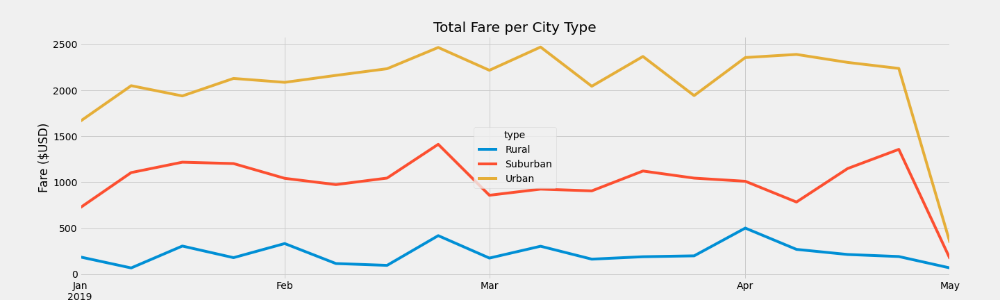
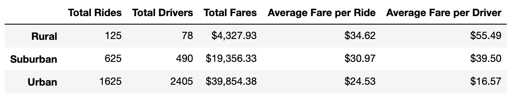
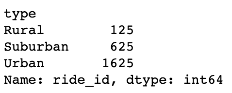
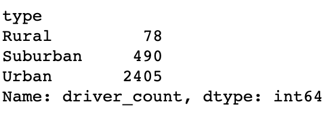
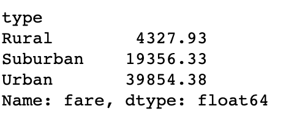
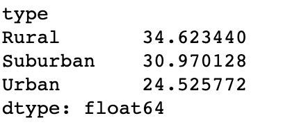
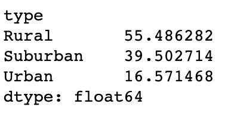

# Pyber Analysis
Module 5

## Overview of Project

Welcome to an exploratory analysis using python scripts with Pandas' libraries, Jupiter Notebook, and MatplotLib to create a visualization of a variety of data as it pertains to PyBer, a ride sharing app. By using the data provided, we can analyze a number of angles based on the amount of rides, the amount of drivers, and the fares paid throughout different city types - this analysis will provide PyBer with the tools to explore how to improve access and create affordability in under serviced areas. 

## Results

The results will break down the following summary per city type:

<B><li>Total Rides per City Type </li></B>

The total ride counts per city type (defined as Rural, Suburban, and Urban) show that there is an expected significant increase, 260%, in larger urban areas than in suburban or rural areas. Likewise, the number of total rides significantly decreases, -500%, further looking at the data from rural cities. 

<B><li>Total Drivers per City Type</li></B>

The total amount fo drivers per city type supports the data reflecting the amount of rides per city type in that there is a significant increase, 490%, in the total driver count in more populated urban cities and further decreasing, -628%, in the suburban cities and further decreasing in the rural cities.  

<B><li>Total Fares per City Type</li></B>

Continuing with the trending data that urban cities have the most activity with the ride share app; the total collected fares provide supporting evidence for this conclusion. The total collected fare for the urban cities is 205% more than the rural cities. Additionally, the total collected fares in the suburban cities is 447% more than the rural cities.  

<B><li>Average Fare per Ride per City Type</li></B>

The average fare per city type reflects that the ride per driver dynamic creates lower fares in the more heavily populated urban cities possibly suggesting that there are more rides that are more competitively priced as the urban average fare is 126% less than the suburban cities and the suburban cities are 112% less than the rural cities. 

<B><li>Average Fare per Driver per City Type</li></B>

The average fare per driver per city type displays that there is a higher average for the rural cities' drivers as the fare is 140% higher than the suburban cities and the urban cities' drivers' average fare is 238% higher than the urban cities' drivers.  
  

## Business Recommendation Summary

The analysis and visualizations offer a look into the different city types to see where there is opportunity to to identify challenges and increase business. A few recommendations are:

1. Increase advertising efforts to drive traffic to booking ride share app fares to increase the fares in urban cities.

2. Increase drivers in rural cities to supplement the demand.

3. Explore more service driven rides in urban areas by targeting customers that are utilizing ride share apps to avoid parking charges, city traffic, travel to and from business and personal appointments and errands. 
